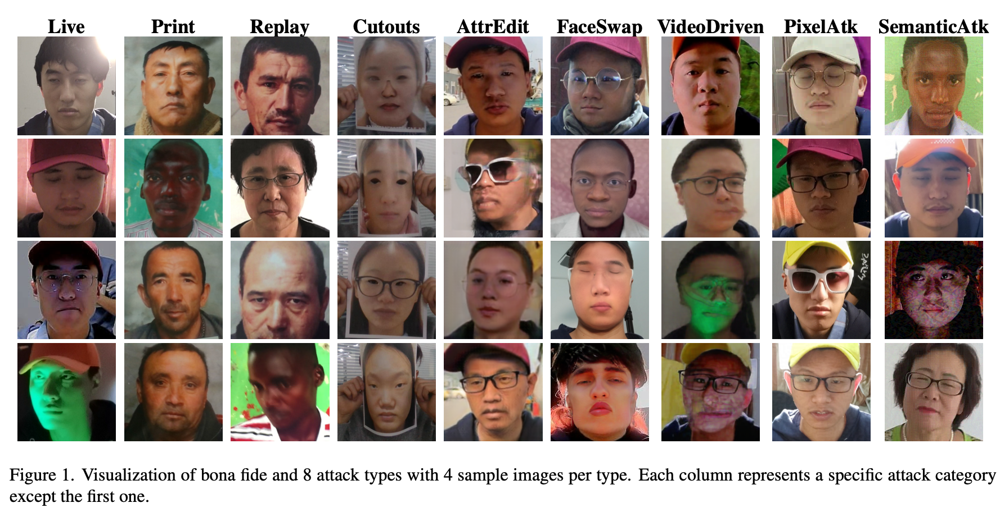
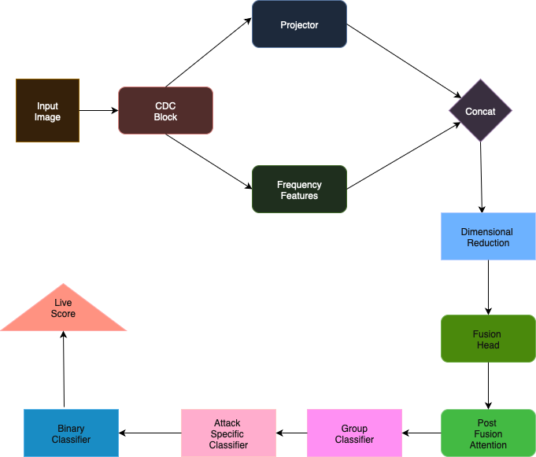

# Oculus
This repository contains the official implementation of the paper: Hierarchical Face Spoof Detection via Frequency-Enhanced Vision Transformers with Group-Aware Classification and Post-Fusion Attention.

### Abstract
This paper presents Oculus, our submission to the 6th Face Anti-Spoofing Challenge on Unified Physical-Digital Attacks Detection (ICCV 2025), where we propose a novel Hierarchical Vision Transformer (ViT)-based architecture for face anti-spoofing. Our method jointly addresses binary live/spoof classification, attack type identification, attack group prediction in a unified hierarchical framework. The proposed architecture leverages a ViT backbone fused with a frequency-domain branch, enhanced by a Central Difference Convolution (CDC) frontend and a Squeeze-and-Excitation (SE) residual block to capture subtle spoofing cues. The model first predicts the coarse attack group before conditionally classifying the specific attack type within the predicted group. In parallel, a binary live/spoof decision is also produced, enabling the model to benefit from hierarchical supervision. Input images might be preprocessed via MTCNN face detection and then use FFT frequency-transformed. The final fused features are regularized using dropout and optimized with binary cross-entropy and softmax losses in a multi-task setting. On the challenge validation set, our Hierarchical ViT architecture achieved an ACER under 7%, while ResNet-based variants achieved ACERs below 5%. Our best model reported an official ACER of 20.14% on the competition leaderboard. These results confirm the effectiveness of our multi-branch, hierarchical ViT framework for robust face anti-spoofing under both physical and digital attack scenarios.


### Dataset overview
The UniAttackData+ training set  presents a hierarchically annotated structure encompassing a wide spectrum of face presentation attacks, including both bona fide samples and multiple spoofing categories. Bona fide faces are labeled as 0_0_0, while physical attacks span subcategories such as Print (1_0_0), Replay (1_0_1), and Cutouts (1_0_2) [1]. In addition, digital manipulations are well represented through three major groups: Digital Manipulation (2_0_x), including AttributeEdit (2_0_0), FaceSwap (2_0_1), and VideoDriven (2_0_2); and Adversarial Attacks (2_1_x), including PixelAttack (2_1_0) and SemanticAttack (2_1_1).



### Architecture


### Set up
The easiest way to set it up is via Google Colab

```notebook
!git clone https://github.com/de20ce/oculus.git
```
To execute the training script, ensure that the `data` directory includes all the necessary files—at a minimum, the training and validation datasets.
You may also update the data location in the script to match the actual path on your system.


### 📝 Citing
```
@misc{WhannouDeDravo:2025,
  Author = {Vincent, Whannou de Dravo and  Kiran, Raja and Mohammed, Bouzidi and Limamou, Gueye and Jon Yngve, Hardeberg},
  Title = {Hierarchical Face Spoof Detection via Frequency-Enhanced Vision Transformers with Group-Aware Classification and Post-Fusion Attention
},
  Year = {2025},
  Publisher = {GitHub},
  Journal = {GitHub repository},
  Howpublished = {\url{https://github.com/de20ce/oculus}}
}
```